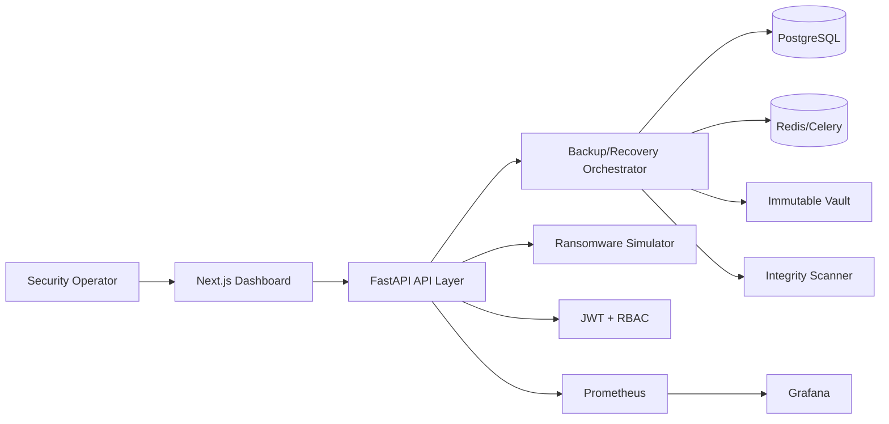
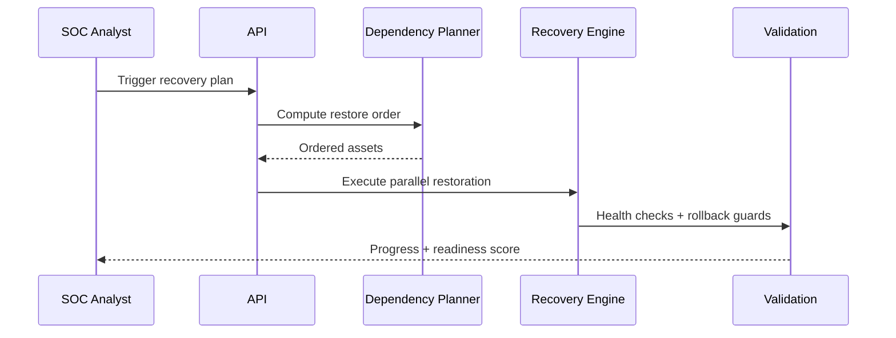
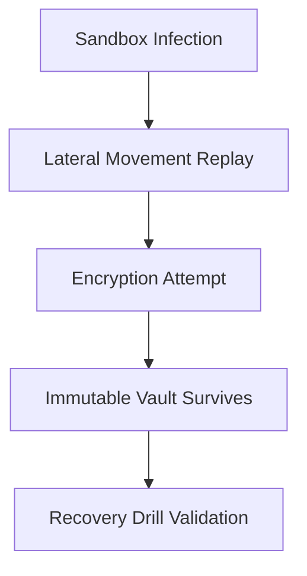

# Architecture

## System Diagram

```mermaid
graph LR
  U[Security Operator] --> FE[Next.js Dashboard]
  FE --> APIGW[FastAPI API Layer]
  APIGW --> ORCH[Backup/Recovery Orchestrator]
  APIGW --> SIM[Ransomware Simulator]
  APIGW --> AUTH[JWT + RBAC]
  ORCH --> DB[(PostgreSQL)]
  ORCH --> REDIS[(Redis/Celery)]
  ORCH --> VAULT[Immutable Vault]
  ORCH --> VERIFY[Integrity Scanner]
  PROM[Prometheus] --> GRAF[Grafana]
  APIGW --> PROM
```

## Recovery Sequence

```mermaid
sequenceDiagram
  participant SOC as SOC Analyst
  participant API as API
  participant DEP as Dependency Planner
  participant REC as Recovery Engine
  participant VAL as Validation

  SOC->>API: Trigger recovery plan
  API->>DEP: Compute restore order
  DEP-->>API: Ordered assets
  API->>REC: Execute parallel restoration
  REC->>VAL: Health checks + rollback guards
  VAL-->>SOC: Progress + readiness score
```

## Attack Simulation Flow

```mermaid
flowchart TD
  A[Sandbox Infection] --> B[Lateral Movement Replay]
  B --> C[Encryption Attempt]
  C --> D[Immutable Vault Survives]
  D --> E[Recovery Drill Validation]
```
